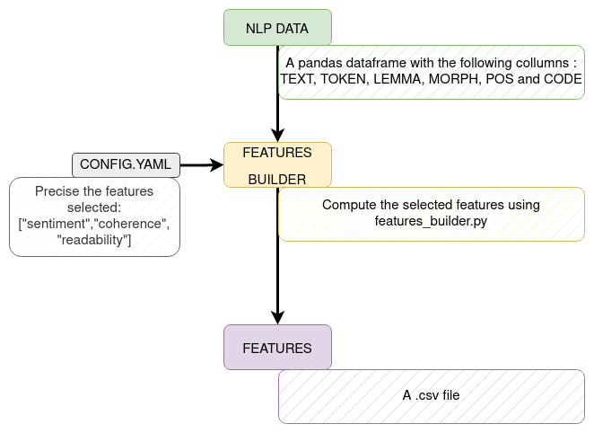

[](https://black.readthedocs.io/en/stable/the_black_code_style/current_style.html)


# TEXT FEATURES TOOLBOX

Extract various information for textual data in order to analyze it with machine learning or statistical tools

This is a research project, so it is not yet ready to be used in production and it will be slow on huge corpus. However, it can be used to extract features on small corpus (less than 10 000 0000 words) and to test some ideas.

This repository is dedicated to French Language. However, some features can be used for other languages but you have to check the code.

You will need to create a .pkl file containing  Morph, pos, token and lemma colmums. You can do it using this repo: https://github.com/binbin83/nlp_pipeline


**contact:** psycholinguistic2125@gmail.com



# Table of content

- [0. About](#0-about)
- [1. Installation](#1-installation)
- [2. Some details on features](#2-some-details)
- [3. To do](#3-to-do)


## 0. About 
For now, available features are the following: 
- Readability scores
- Text coherence indicators
- Dysfluency analysis
- Sentiment analysis
- TextGraph structure analysis
- Passive way Detection
- LIWC analysis
- Morphosyntax statsitics
- Customs NER extractor (cf models/ner)
- Coherence analysis

## 1. Installation
To make it work:  (3.9 will also work)
- Create a virtual environment (python3.8 -m venv /path/to/env)
- Activate the environment (source /path/to/env/bin/activate)
- Clone the directory (git clone )
- Install dependencies (pip install -r requirements.txt)
- correct liwc package: 
    - go to the file : /path/to/env/lib/python3.9/site-packages/liwc/dic.py
    - replace the line 36 by: 
    ```
    with open(filepath, encoding="latin1") as lines:
    ```
- install coreferee model : 

    ```
    python3 -m coreferee install fr
    ```

- download spacy model: 
    ```
    python -m spacy download fr_core_news_lg
    python -m spacy download fr_dep_news_trf
    ```
- Change the config file (*config.yaml*) according to the data file
- Check how each features work in *notebooks/demo.ipynb*
- Launch the extraction of desired features with *python3.8 main.py*
- Check the results in *data/extracted_features.csv*

## 2. Some details on features

### 2.1 **Sentiments** analysis

In the sentiments analysis, we extract scores using lexical and inferential methods. Here is a list of the scores we compute: 
- labMT scores
- textblob
- feel scores
- polarimot lexiques scores 
- empath scores
- gobin score


### 2.2 **Readability** analysis
To compute readability scores, we use the implementation proposed by:  

> Nicolas Hernandez, Tristan Faine and Nabil Oulbaz, Open corpora and toolkit for assessing text readability in French, [2nd Workshop on Tools and Resources for People with REAding DIfficulties (READI@LREC)](https://cental.uclouvain.be/readi2022/accepted.html), Marseille, France, June, 24th 2022

The associated code can be found here: https://github.com/nicolashernandez/READI-LREC22

### 2.3 **Coherence** analysis

We implemented the analysis of the following publication that apply LDA coherence analysis to schizophrenia detection.

> Quantifying incoherence in speech: An automated methodology and novel application to schizophrenia, Elvevåg et al. ; 2007; https://europepmc.org/backend/ptpmcrender.fcgi?accid=PMC1995127&blobtype=pdf

We extended this methods with others embeddings such as Fasttext, doc2vec, Wod2vec, lsi. The implementation of the training pipeline for these models used Gensim.

### 2.4 **Dysfluency** analysis

Dysfluency analysis is this project is an draft and falls into 2 parts:
1.  We use a spacy.Matcher to find words, onomatope, "...", particles
2. we use Pyphen modules to compute syllabus and detect repetition.

More resources and ideas might be found here:
- https://rhapsodie.modyco.fr/
- https://www.researchgate.net/publication/281557958_Automatic_Detection_and_Annotation_of_Disfluencies_in_Spoken_French_Corpora
-  https://archivesic.ccsd.cnrs.fr/sic_00001231/document
- https://hal.inria.fr/hal-01585540/document


### 2.5 **TextGraph** analysis

We implemented the analysis of the following publication that apply speechGraph to psychosis detection.
> Speech Graphs Provide a Quantitative Measure of Thought Disorder in Psychosis, mota et al., 2012, https://pdfs.semanticscholar.org/e9a8/ba05265c76527b4b3afb401264604ad55cdc.pdf

### 2.6 **Passive way** analysis

The detection of passive way in french text has resulted in an independent project, that yoy can find here: https://github.com/binbin83/passive_detection_app

A demonstration tools is also online: https://passive-fr.streamlit.app/


### 2.7 **LIWC** analysis

Linguistic Inquiry and  Word Count is a tools developed by Pennebaker. 
> James W. PennebakerMartha E. FrancisRoger J. Booth, Linguistic inquiry and word count (LIWC), January 1999.

The french version, was constructed by Piolat in 2011.
> A. Piolat,R.J. Booth, C.K. Chung, M. Davids, J.W. Pennebaker, The French dictionary for LIWC: Modalities of construction and
examples of use; January 2011.

The python implementation is available: https://pypi.org/project/liwc/


### 2.8 **Custom NER** analysis

In our classification task, we wanted to extract specific features that we could not found online for French, so we train custom spacy NER models after having annotated some of our data. A dedicated project can be found here: https://gitlab.iscpif.fr/rquillivic/13_november_annotation
Now we have 4 NER custom models: 
- **ON_MODEL**:  detect different value of pronoun ("on" in french)
- **PRESENT_MODEL**: detect different value of present time (historical present, generic present, enunciation present)
- **DEATH_MODEL**: detect the lexical field associated to death (explicit and implicit mentions)
- **SENSATIONS_MODEL**: detect the lexical field associated with the body, sensation and perception

Models are available on huggingface hubs: 
- https://huggingface.co/binbin83/fr_present_tense_value
- https://huggingface.co/binbin83/fr_on_value
- https://huggingface.co/binbin83/fr_sensations_and_body
- https://huggingface.co/binbin83/fr_lexical_death


## 3. Todo
In order to continue: 
- [ ] uniformize features enter with a spacy.Doc instead of the columns
- [ ] add test to check data consistency and results coherence
- [ ] add new features